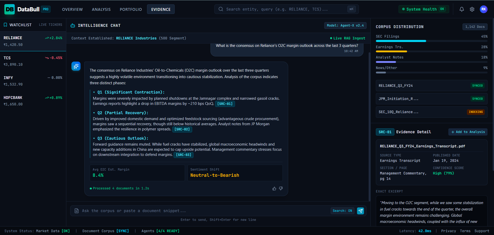
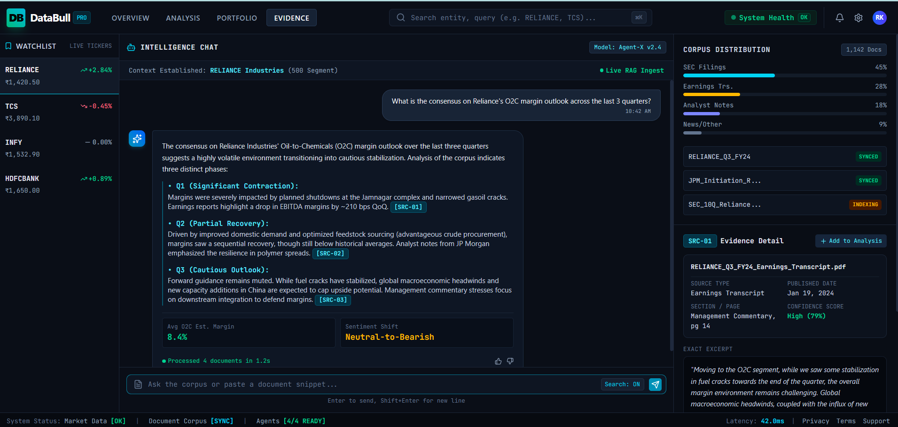
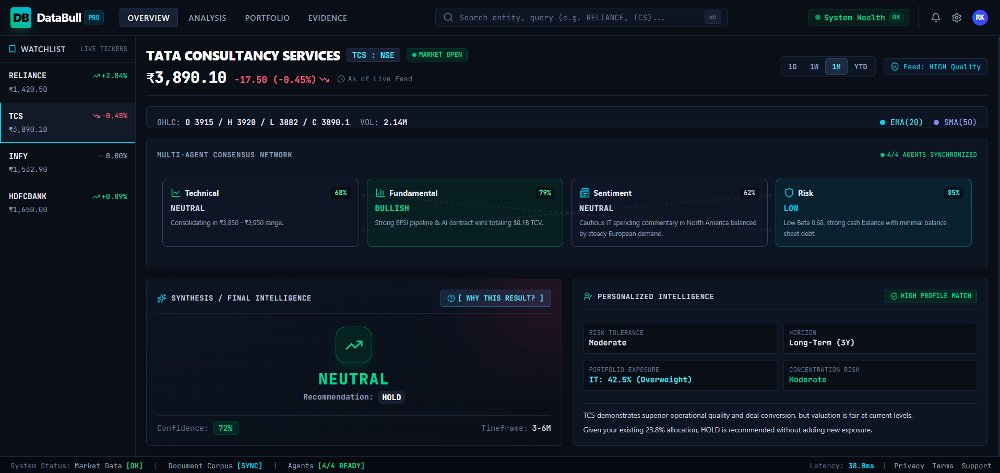
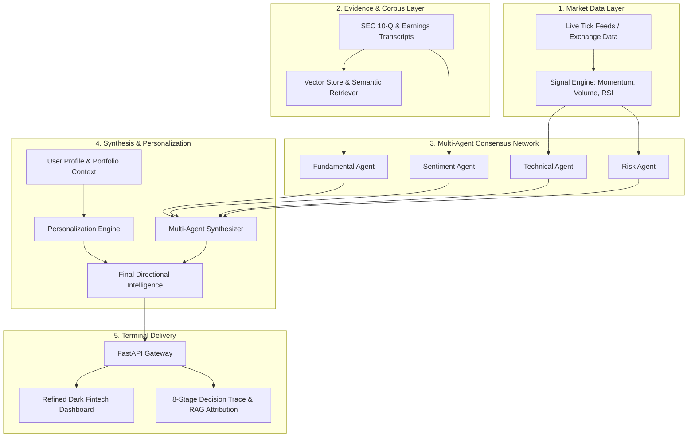

# DataBull — Multi-Agent Autonomous Financial Intelligence System for Retail Investors

[](https://fastapi.tiangolo.com)
[](https://react.dev)
[](https://www.typescriptlang.org/)
[](https://tailwindcss.com/)
[](LICENSE)

> **DataBull** is an institutional-grade, multi-agent financial intelligence terminal engineered for retail investors. It bridges the gap between raw market signals, unstructured regulatory filings, and portfolio-tailored intelligence through verifiable agent consensus and transparent decision reasoning.

---

## 📸 Terminal Interface & Screenshots

### 1. Refined Intelligence Dashboard


### 2. [ WHY THIS RESULT? ] Multi-Stage Decision & Reasoning Trace


### 3. Evidence Intelligence & Financial Corpus Q&A


---

## 🏛️ System Architecture



---

## 📂 Project Structure & Modules

```
d:/hacakthon/
├── market_signal_engine/       # Module 1: Market data, momentum, volume & indicator calculations
├── financial_document_rag/     # Module 2: Document loaders, vector embeddings & semantic retrieval
├── user_portfolio_engine/      # Module 3: Investor risk profiles, asset exposure & concentration engine
├── multi_agent_orchestrator/   # Module 4: Autonomous agents, consensus weighting & synthesis logic
├── databull_gateway_app/       # Module 5: Unified FastAPI Gateway, Adapters & React 19 Terminal UI
│   ├── gateway/                # FastAPI normalized gateway server (Port 8000)
│   ├── adapters/               # Zero-modification resilience adapters for Modules 1-4
│   ├── contracts/              # Strict schema definitions & normalized contracts
│   └── frontend/               # Dark-first React 19 + TypeScript + Tailwind v4 Web Terminal
├── docs/                       # Technical specifications, audits & interface documentation
│   ├── FRONTEND_API_CONTRACT.md# Data exchange contract & normalized payload specs
│   ├── INTEGRATION_AUDIT.md    # Multi-agent system integration audit & degradation guarantees
│   └── screenshots/            # High-resolution application screenshots
└── README.md                   # Project documentation & execution guide
```

---

## 🚀 Key Features

### 1. Refined Intelligence Dashboard
- **Live Watchlist**: Real-time tracking for `RELIANCE`, `TCS`, `INFY`, and `HDFCBANK`.
- **Interactive OHLC & Volume Chart**: Price trajectory, moving average confluences (EMA 20 / SMA 50), and volume anomaly bars.
- **Multi-Agent Consensus Network**: Real-time status, signals, confidence scores, and reasoning for **Technical**, **Fundamental**, **Sentiment**, and **Risk** agents.
- **Synthesis Centerpiece**: High-conviction directional calls (`BULLISH 81%`) with horizon recommendations (`BUY`, `ACCUMULATE`, `HOLD`).
- **Personalized Intelligence**: Portfolio alignment, sector underweight/overweight flags, and concentration risk metrics.

### 2. [ WHY THIS RESULT? ] Explainability Drawer
- **Cryptographic Decision Trace**: 8-stage verifiable pipeline trace (`Market Data` → `Signal Engine` → `Technical Agent` → `RAG Retrieval` → `Fundamental Agent` → `Sentiment Agent` → `Risk Agent` → `Synthesis`).
- **Supporting vs Counter-Signals**: Explicit breakdown of positive drivers versus macroeconomic risks.
- **9-Field RAG Source Attribution**: Full attribution (`Title`, `Source Type`, `Section/Page`, `Published Date`, `Relevance %`) with verbatim excerpts.

### 3. Evidence Intelligence & Corpus Q&A
- **Corpus Distribution**: Analysis breakdown across SEC filings, earnings transcripts, and analyst research notes.
- **Inline Citation Tags**: Clickable source references (`[SRC-01]`, `[SRC-02]`, `[SRC-03]`) that instantly inspect exact excerpts and entity sentiment.

---

## ⚡ Quick Start Guide

### Prerequisites
- **Python 3.10+** (Python 3.14 compatible)
- **Node.js 18+** & **npm**

### 1. Run the Unified Gateway & Application
```bash
# From project root
python -m uvicorn databull_gateway_app.gateway.main:app --host 0.0.0.0 --port 8000
```
Open **[http://localhost:8000](http://localhost:8000)** in your browser.

### 2. (Optional) Run the Frontend in Development Mode
```bash
cd databull_gateway_app/frontend
npm install
npm run dev
```
Open **[http://localhost:5173](http://localhost:5173)** in your browser.

---

## 📡 API Reference

| Endpoint | Method | Description |
| :--- | :--- | :--- |
| `/api/health` | `GET` | System health check (Market Data, Corpus, 4/4 Agents) |
| `/api/symbols` | `GET` | List active watchlist tickers and current quotes |
| `/api/analyze` | `POST` | Execute multi-agent analysis for a given symbol & user profile |
| `/api/signals/{symbol}` | `GET` | Retrieve raw market signals and indicator evidence |
| `/api/retrieve` | `POST` | Query vector store for semantic document chunks |
| `/api/corpus/chat` | `POST` | Structured multi-document AI synthesis with citation tags |

---

## 🛡️ Data Quality & Honesty Principles
- **No Fabricated Backtests**: Accuracy metrics are explicitly labeled as **Simulated / Model Confidence** to respect financial reporting integrity.
- **Fault-Tolerant Degradation**: If an individual upstream service experiences network failure, other agents continue uninterrupted with graceful quality degradation flags.

---

## 👥 Documentation & Architecture Specs
- [Frontend API & Data Contract](docs/FRONTEND_API_CONTRACT.md)
- [System Integration Audit](docs/INTEGRATION_AUDIT.md)
